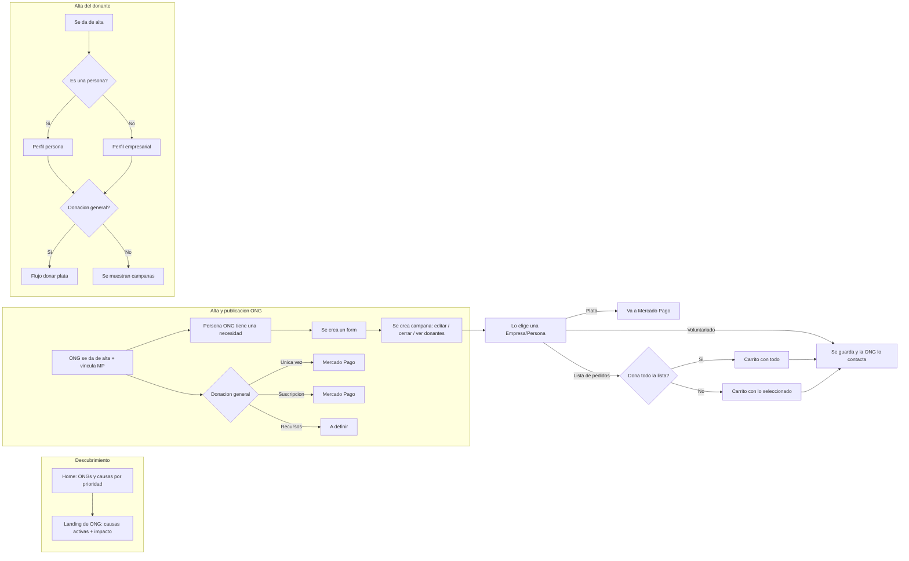

# PRD

**Track**: 2 · Donantes, vínculos y sostenibilidad económica
**Hackathon**: Paisanos × Crecimiento Build
**Owner**: Juli | **Fecha**: 06/06/2026
**Estado**: Draft — alineado al flujo del board (Halketon)

> Este doc documenta el flujo **tal como está diseñado en el board**, sin cambios.
Es la base para arrancar a construir hoy. Las ideas que quedaron afuera del MVP
están parkeadas en la sección "Fuera de alcance".
> 

---

## 1. Overview

Plataforma que conecta **ONGs** con **donantes** (personas o empresas). Las ONGs se dan
de alta, publican necesidades/campañas (plata, especie o voluntariado) y reciben aportes.
Los donantes descubren causas, eligen una y aportan. Las donaciones de plata se procesan
con **Mercado Pago**; las de especie y voluntariado se registran para que la ONG coordine.

**Por qué ahora**: muchas ONGs dependen de cooperación internacional y grants, y necesitan
diversificar hacia donantes individuales, pero no tienen la infraestructura para captarlos
ni gestionarlos. Esta plataforma les da los rieles sin que necesiten montar un CRM propio.

---

## 2. Actores

| Actor | Quién es | Qué hace en la plataforma |
| --- | --- | --- |
| **ONG** | Organización que se da de alta | Publica necesidades/campañas, gestiona donaciones, ve su tabla de donantes |
| **Donante – Persona** | Individuo que quiere ayudar | Descubre causas, dona plata / especie / tiempo |
| **Donante – Empresa** | Empresa que quiere aportar | Igual que persona, con perfil y datos corporativos |

---

## 3. Flujo (fiel al board)

### 3.1 Alta y publicación de la ONG

1. **ONG se da de alta** → datos: logo, nombre, descripción / causas, **vincular cuenta de MP**
para recibir donaciones, y **decide qué tipos de donación puede recibir**.
2. **Una persona de la ONG tiene una necesidad.**
3. **Se crea un form** con: imagen, título, descripción (**con dictado por voz**), tipo de
usuario objetivo (persona / empresa), fecha límite, urgencia y **tipo de necesidad**
(plata / cosas / gente).
4. **Se crea la campaña** → acciones disponibles: editar, cerrar causa o convocatoria,
eliminar, y **ver tabla de donantes**.

### 3.2 Donación general (rama desde el alta de ONG)

Además de campañas puntuales, la ONG habilita una **donación general** con tres modalidades:

- **Única vez** → Mercado Pago
- **Suscripción** → Mercado Pago
- **Recursos** → *(a definir)*

### 3.3 El donante elige una campaña

Cuando **una empresa o persona elige** una campaña, el aporte puede ser de tres tipos:

- **Plata** → va a Mercado Pago.
- **Lista de pedidos (especie)** → decisión: *¿dona todo lo de la lista?*
    - **Sí** → se arma un "carrito" con todo.
    - **No** → se arma un "carrito" con lo seleccionado.
    - → **se guarda la info y la ONG lo contacta.**
    - *Validaciones a hacer*: ¿tiene movilidad para llevar el pedido? ¿cosas nuevas o usadas?
    si son alimentos / medicamentos, ¿tienen vencimiento próximo?
- **Voluntariado** → **se guarda la info y la ONG lo contacta.**

### 3.4 Alta del donante

1. **Se da de alta** → decisión: *¿es una persona?*
    - **Sí** → se crea el **perfil**: nombre, apellido, mail, teléfono, intereses.
    - **No** → se crea el **perfil empresarial**: nombre de empresa, razón social, CUIT,
    rubro / industria, objetivo, mail de contacto.
2. Decisión: *¿quieren hacer una donación general?*
    - **Sí** → flujo para donar plata.
    - **No** → se muestran las campañas.

### 3.4.1 Objetivos anuales de participación

Una vez creado el perfil, el donante puede **setear objetivos anuales** por tipo de aporte.
Son opcionales y editables en cualquier momento desde su perfil.

Ejemplos:

- *"Quiero hacer 3 voluntariados este año"*
- *"Quiero donar especie 2 veces"*
- *"Quiero aportar $X en plata durante el año"*

El progreso se actualiza automáticamente cada vez que se confirma un aporte. El donante
ve en su perfil cuánto lleva vs. lo que se propuso — como un tracker personal de impacto.

**Estados posibles por objetivo:**

- `en curso` — tiene meta seteada y progreso < meta
- `cumplido` — progreso ≥ meta
- `sin meta` — nunca seteó ese tipo de objetivo

### 3.5 Descubrimiento

- **Home** con ONGs y causas **ordenadas por prioridad**.
- **Landing individual de ONG**: nombre, logo, descripción, **causas activas**,
**causas pasadas** ("social proof" / impacto) y CTA **"Quiero donar"**.

### 3.6 Diagrama



---

## 4. Modelo de datos (borrador)

```
ong
  id, nombre, logo_url, descripcion, mp_account_id,
  tipos_donacion_habilitados (plata | especie | voluntariado | general)

campania
  id, ong_id, titulo, imagen_url, descripcion, audio_url (dictado),
  tipo_necesidad (plata | especie | voluntariado),
  target_donante (persona | empresa), fecha_limite, urgencia,
  estado (activa | cerrada | eliminada)

item_pedido            -- para campañas de especie
  id, campania_id, nombre, cantidad, nuevo_o_usado, vencimiento

donante
  id, tipo (persona | empresa), nombre, apellido, mail, telefono, intereses
  -- si empresa: razon_social, cuit, rubro, objetivo, mail_contacto

aporte
  id, donante_id, campania_id (nullable si es donacion general),
  tipo (plata | especie | voluntariado),
  monto (si plata), modalidad (unica | suscripcion),
  estado (pendiente | confirmado | a_coordinar),
  mp_payment_id, fecha

donacion_general
  id, ong_id, donante_id, modalidad (unica | suscripcion | recursos),
  monto, mp_subscription_id, estado

objetivo_donante          -- objetivos anuales de participación del donante
  id, donante_id, anio (int),
  tipo (plata | especie | voluntariado),
  meta_cantidad (int, nullable),      -- ej: 3 voluntariados
  meta_monto (decimal, nullable),     -- ej: $10.000 en plata
  progreso_cantidad (int),            -- se incrementa al confirmar un aporte
  progreso_monto (decimal),
  estado (en_curso | cumplido | sin_meta)
```

> `aporte.estado = a_coordinar` cubre las ramas de especie y voluntariado
("se guarda la info y la ONG lo contacta"). `Ver tabla de donantes` lee de `aporte` + `donante`.
> 

---

## 5. Stack propuesto

| Capa | Tecnología | Por qué |
| --- | --- | --- |
| Frontend | Next.js 14 + Tailwind + shadcn/ui | Rápido, conocido por el equipo |
| Backend / DB / Auth | Supabase (Postgres + RLS + Edge Functions) | Cero infra, multi-tenant por ONG |
| Pagos | Mercado Pago (Checkout + Preapproval para suscripción + webhooks) | Estándar en AR, soporta recurrencia |
| Dictado por voz | Web Speech API (o transcripción en Edge Function) | Para crear la necesidad por voz |

---

## 6. Alcance del MVP para la hackathon

**Objetivo del demo**: una ONG publica una campaña de plata, un donante la descubre desde
el home y dona vía Mercado Pago, y la ONG lo ve en su tabla de donantes.

### Dentro del MVP (P1)

- [ ]  Alta de ONG + vincular MP (puede ser mock/sandbox).
- [ ]  Crear campaña (form completo; dictado por voz opcional).
- [ ]  Home con causas por prioridad + landing de ONG con impacto.
- [ ]  Alta de donante (persona; empresa si sobra tiempo).
- [ ]  **Aporte de plata por Mercado Pago (sandbox).**
- [ ]  Tabla de donantes para la ONG.

### P2 (si hay tiempo)

- [ ]  Donación general (única vez / suscripción).
- [ ]  Rama de especie (carrito + "a coordinar").
- [ ]  Rama de voluntariado.
- [ ]  Dictado por voz real.
- [ ]  **Objetivos anuales de participación del donante** (seteo de metas + tracker de progreso en el perfil).

---

## 7. Offline — form de creación de campaña (ONG)

El paso **"Se crea un form"** (sección 3.1) tiene que poder **resolverse sin conexión**: la
persona de la ONG puede estar en campo o con mala señal y necesita poder cargar la necesidad
igual. No toca plata, así que es 100% offline-friendly.

### Qué pasa según la conexión

| Acción | Online | Offline |
| --- | --- | --- |
| Abrir el form | Carga normal | Carga desde el service worker (app shell cacheado) |
| Completar campos | Normal | Normal — todo es local hasta el submit |
| Submit de la campaña | Va directo a Supabase | Se guarda en **cola local** y se sincroniza al reconectar |
| Imagen | Sube a Supabase Storage | Se guarda el blob local y se sube al reconectar |
| Dictado por voz | Transcribe online | Graba el audio local → se transcribe al reconectar (o se tipea) |

### Cómo funciona

1. **PWA + service worker** (`next-pwa`): cachea el app shell y el form, así abre sin conexión.
2. **Submit offline → cola local en IndexedDB**: al enviar, la campaña se escribe localmente
con un `local_id` (UUID generado en el cliente) y `sync_estado = pendiente`. La UI confirma
con un estado claro: **"Guardada — se sincronizará al recuperar conexión"**.
3. **Imagen**: se guarda el blob en IndexedDB (idealmente comprimido en el cliente antes de
encolar). Al reconectar se sube a Storage y recién ahí se completa la URL en el registro.
4. **Dictado por voz**: la Web Speech API del navegador normalmente necesita conexión, así que
offline se graba el audio a un blob local y se encola para transcribir al volver (Edge
Function). Fallback siempre disponible: tipear la descripción.
5. **Sync al reconectar**: con el evento `online` (o la Background Sync API) se vuelca la cola
a Supabase. El `local_id` hace el upsert **idempotente** → reconectar dos veces no duplica
campañas.

### Ajuste al modelo de datos

```
campania
  ...campos previos...
  local_id     uuid   -- generado en el cliente, clave de idempotencia
  sync_estado  (pendiente | sincronizada)
```

### Estados de UI a contemplar

- **Borrador local**: el form se está completando sin conexión.
- **Pendiente de sincronizar**: enviada, esperando red (badge visible en la lista de campañas).
- **Sincronizada**: confirmada en Supabase.

### Boundary

Esto cubre **crear y registrar** la campaña offline. Lo que sigue después (recibir aportes de
plata) requiere conexión, pero eso es del lado del donante, no del form de la ONG.

### Demo

Modo avión → crear una campaña con imagen → ver **"pendiente de sincronizar"** → reconectar →
la campaña aparece publicada y en la lista, sin duplicados.

---

## 8. Plan de build (estimaciones, equipo chico)

> Estimaciones en rangos; asumen Supabase + Next ya inicializados y MP en sandbox.
> 

| Fase | Tareas | Estimado | Confianza |
| --- | --- | --- | --- |
| 1. Setup + schema + seed | repo, Supabase, tablas, datos demo | 2–3h | Alta |
| 2. Alta ONG + crear campaña | forms + persistencia | 3–5h | Media |
| 3. Home + landing de ONG | listado por prioridad + detalle | 3–4h | Alta |
| 4. Alta donante + aporte plata (MP) | checkout + webhook | 4–6h | Media |
| 5. Tabla de donantes | lectura + UI | 1–2h | Alta |
| 6. **Offline del form de campaña** | PWA + cola IndexedDB + sync idempotente | 4–6h | Media |
| 7. Pulido + ensayo del demo | copy, estados vacíos, guion | 2–3h | Media |

**Riesgo principal**: integración con Mercado Pago (webhooks + sandbox). Si se complica,
mostrar el pago como mock controlado y dejar el MP real como "si llega el tiempo".

---

## 9. Success criteria del demo

- **SC-001**: una ONG crea una campaña de punta a punta en < 2 min.
- **SC-002**: un donante completa un aporte de plata sin trabarse.
- **SC-003**: el aporte aparece en la tabla de donantes de la ONG en vivo.
- **SC-004**: una campaña creada en modo avión se sincroniza sola al reconectar, sin duplicarse.

---

## 10. Preguntas abiertas (del board)

- `[NEEDS CLARIFICATION]` ¿Cómo estructurar las donaciones a nivel **empresa**?
- `[NEEDS CLARIFICATION]` ¿Qué datos hay que pedirle a una empresa? ¿Hay **documentación legal** al respecto?
- `[NEEDS DESIGN]` ¿Qué sería más útil mostrar en el home / landing?
- `[NEEDS CLARIFICATION]` ¿Tiene sentido una **opción abierta** para generar un contacto?
- `[NEEDS CLARIFICATION]` ¿Qué es "Recursos" dentro de donación general?

---

## 11. Fuera de alcance (backlog v2 — no toca el flujo actual)

Parkeado para después de la hackathon, sin modificar lo diseñado:

- Capa de **retención por WhatsApp**: agradecimiento automático, aviso de impacto,
recuperación de débitos rechazados y radar de baja. (Convierte el paso manual
"la ONG lo contacta" en automatización; alinea con el corazón del Track 2.)
- Segmentación de comunicaciones por intereses del donante.
-